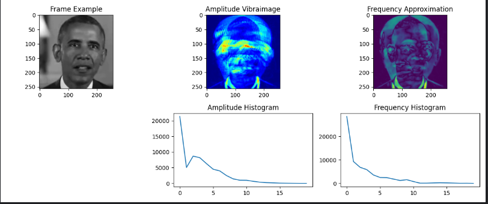
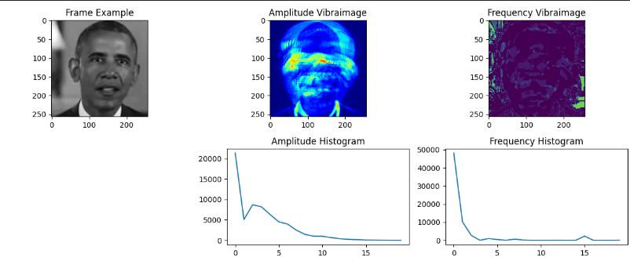
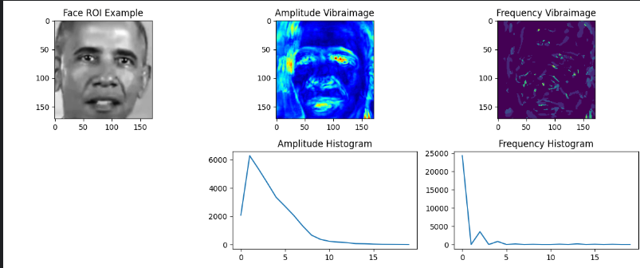

# VibraImage Project

This project demonstrates various techniques for generating and visualizing vibraimages using Python, OpenCV, and Matplotlib. The project includes three main scripts: `simple_fq.py`, `ft_main.py`, and `ft_face.py`.

## Requirements

- Python 3.x
- OpenCV
- NumPy
- Matplotlib

Install the required packages using pip:

```sh
pip install opencv-python numpy matplotlib
```

## Scripts

### `simple_fq.py`

This script captures frames from a webcam, converts them to grayscale, and generates amplitude and frequency vibraimages. It also visualizes the results using Matplotlib.

#### Usage

```sh
python simple_fq.py
```

#### Key Steps

1. **Image Acquisition**: Captures 30 frames from the webcam.
2. **Pre-processing**: Converts frames to grayscale.
3. **Vibraimage Generation**: Calculates amplitude and frequency vibraimages.
4. **Feature Extraction & Analysis**: Generates histograms for amplitude and frequency.
5. **Visualization**: Displays the original frame, amplitude vibraimage, frequency vibraimage, and histograms.

#### Example Output



### `ft_main.py`

This script captures frames from a webcam, converts them to grayscale, and generates amplitude and frequency vibraimages using Fourier Transform. It also visualizes the results using Matplotlib.

#### Usage

```sh
python ft_main.py
```

#### Key Steps

1. **Image Acquisition**: Captures 30 frames from the webcam.
2. **Vibraimage Generation**: Calculates amplitude and frequency vibraimages using Fourier Transform.
3. **Feature Extraction & Analysis**: Generates histograms for amplitude and frequency.
4. **Visualization**: Displays the original frame, amplitude vibraimage, frequency vibraimage, and histograms.

#### Example Output



### `ft_face.py`

This script captures frames from a webcam, detects faces using Haar Cascade, and generates amplitude and frequency vibraimages for the detected face regions. It also visualizes the results using Matplotlib.

#### Usage

```sh
python ft_face.py
```

#### Key Steps

1. **Load Face Detection Model**: Loads the Haar Cascade model for face detection.
2. **Image Acquisition**: Captures 30 frames from the webcam and detects faces.
3. **Vibraimage Generation**: Calculates amplitude and frequency vibraimages for the detected face regions.
4. **Feature Extraction & Analysis**: Generates histograms for amplitude and frequency.
5. **Visualization**: Displays the face region, amplitude vibraimage, frequency vibraimage, and histograms.

#### Example Output



