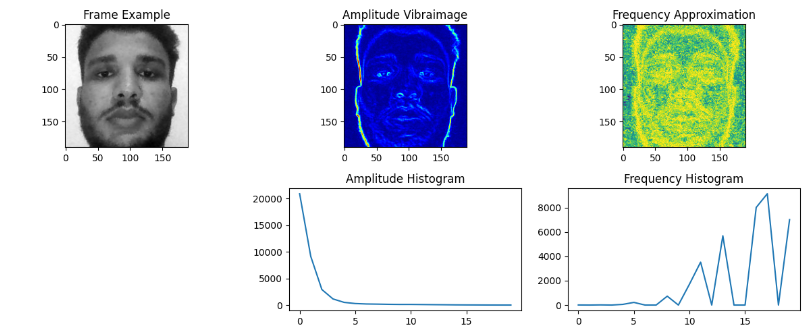
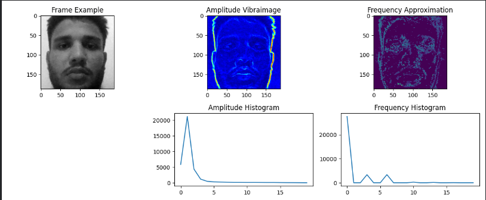

# VibraTest

## Overview

VibraTest is a Python-based tool designed for the analysis of vibration images using video inputs. It provides various methods for capturing frames from video or camera, performing frequency and amplitude analysis, and visualizing the results. The tool can also detect faces in the frames and analyze vibrations specifically within the face regions.

## Installation

To run VibraTest, ensure you have the following Python packages installed:

- `numpy`
- `opencv-python`
- `matplotlib`

You can install these packages using pip:

```bash
pip install numpy opencv-python matplotlib
```

## Usage

### Running the Script

The main script is `VibraTest.py`, which guides you through the process of capturing frames, performing analysis, and visualizing or saving the results.

To run the script:

```bash
python VibraTest.py
```

### Working Modes

When you run `VibraTest.py`, you will be prompted to choose between different modes of operation:

1. **Source Selection**:
   - Choose between capturing frames from a live camera feed or a pre-recorded video file.
   - Enter `1` for Camera or `2` for Video, and provide the path if you selected Video.

2. **Frame Capturing**:
   - Specify the number of frames to capture for the analysis.

3. **Face Detection**:
   - Choose whether to detect and analyze only the faces within the frames. This mode helps focus the analysis on the facial regions.

4. **Analysis Type**:
   - Choose between:
     - Literature frequency analysis.
     - FFT frequency analysis.

### Saving and Visualizing Results

After performing the analysis, you will be prompted to save the results. The results include amplitude and frequency vibraimages, as well as their histograms. You can also choose to visualize these results directly within the script.

### Example Output

```bash
Welcome to VibraTest!
1. Camera
2. Video
Choose you need camera or video (1, 2): 1
Enter the number of frames: 100
Capturing frames...
Frames captured!
Do you want to detect faces only? (1, 0): 1
1. Literature frequency analysis
2. FFT frequency analysis
Choose you need Literature frequency analysis or fft frequency analysis(1, 2): 2
Performing analysis...
Analysis complete!
Extracting features...
Features extracted!
Would you like to save the results? (y/n) y
Enter the prefix for the output files: sample_test
Results saved with prefix 'sample_test'.
Visualizing results...
```
#### Test Output Literature

#### Test Output FFT

## Function Details

### `vibra_utils.py`

1. **capture_frames(video_path, num_frames=30)**:
   - Captures grayscale frames from the video or camera.
   - Returns a list of captured frames.

2. **capture_frames_Fin(video_path, num_frames=30)**:
   - Similar to `capture_frames` but also returns the frame rate `Fin` of the video.

3. **extract_features(amplitude_vibraimage, frequency_vibraimage)**:
   - Extracts histograms of the amplitude and frequency vibraimages.
   - Returns the amplitude and frequency histograms as numpy arrays.

4. **visualize_results(frames, amplitude_vibraimage, frequency_vibraimage, amplitude_hist, frequency_hist)**:
   - Visualizes the first frame, amplitude vibraimage, frequency vibraimage, and their histograms using matplotlib.

5. **save_results(amplitude_vibraimage, frequency_vibraimage, amplitude_hist, frequency_hist, output_prefix="output")**:
   - Saves the vibraimages and histograms to files with a given prefix.

6. **calculate_amplitude(frames)**:
   - Calculates the amplitude component for each point in the frames using a simple difference method.
   - Returns the amplitude vibraimage.

7. **calculate_frequency(frames, Fin)**:
   - Calculates the frequency component for each point in the frames using a simple indicator-based method.
   - Returns the frequency vibraimage.

8. **calculate_fft_frequency_amplitude(frames, Fin)**:
   - Calculates both the amplitude and frequency components for each point using FFT.
   - Returns the amplitude and frequency vibraimages.

9. **preprocess_frames(frames)**:
   - Converts a list of grayscale frames into a 3D numpy array for further processing.

### `ft_face_modular.py`

1. **load_face_detector()**:
   - Loads and returns the Haar Cascade face detection model from OpenCV.

2. **detect_faces(gray_frame, face_cascade)**:
   - Detects faces in a given grayscale frame using the loaded face cascade classifier.
   - Returns a list of detected face bounding boxes.

3. **extract_face_rois(frames, faces)**:
   - Extracts the regions of interest (ROIs) corresponding to detected faces from a list of frames.
   - Returns a list of face ROIs.

4. **preprocess_faces(face_rois)**:
   - Ensures all extracted face ROIs are of the same size and converts them into a 3D numpy array.
   - Returns the preprocessed face regions.

## Refrences
[Application of Vibraimage Technology and System for Analysis of Motor Activity and Study of Functional State of the Human Body](https://www.researchgate.net/publication/225137210_Application_of_vibraimage_technology_and_system_for_analysis_of_motor_activity_and_study_of_functional_state_of_the_human_body)

## Contact
**Email:** musgamal05@gmail.com